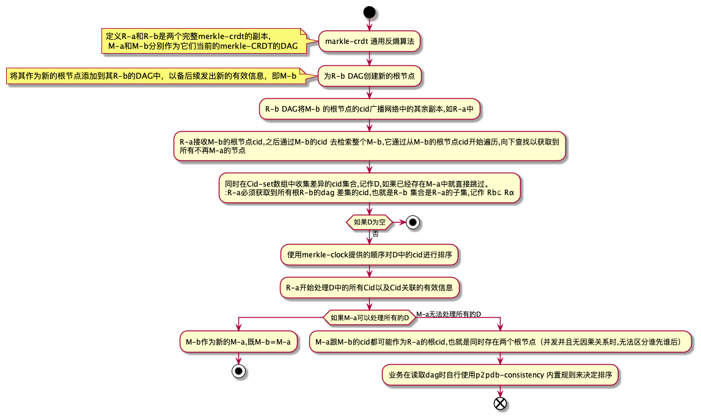

<h1 align="center">
  <br>
  p2pdb-log
  <br>
</h1>

基于默克尔-CRDT实现的只允许追加的日志组件
[Merkle-CRDT](https://research.protocol.ai/blog/2019/a-new-lab-for-resilient-networks-research/PL-TechRep-merkleCRDT-v0.1-Dec30.pdf)

### 运行测试
``` 

```
### 内容列表 


- [目标](#目标)
	- [使用场景](#使用场景)
- [架构](#架构)
	- [目录分层](#目录分层)

## 背景
P2PDB数据库在p2pdb-log之上实现，p2pdb-log是一种用于分布式系统的不可变的、基于操作的无冲突复制数据结构 (CRDT)与Merkle DAG（有向无环图）实现。如果所有 P2PDB 数据库类型都不符合您的需求和/或您需要特定于案例的功能，您可以轻松使用日志模块实现您想要的数据库


## 核心实现
#### GSET(Grow-only Set)仅增长集
GSet是一个非常简单的CRDT，p2pdb-log 使用它实现事件日志记录

#### Merkle DAG 
是一种被称为有向无环图的数据结构，p2pdb-log 使用它存储事件的因果关系

### Merkle-CRDT 通用反熵算法



### 仅附加日志
不可变日志，用于存储经过因果关系排序的数据更改条目，此日志为仅附加日志，这意味着只能将数据添加到日志中，而无法重写或删除数据。这样可确保已存储的更改历史记录无法被删除或修改。即使所有节点都被删除数据，仍可通过从不可变日志中恢复完整数据库。


#### 事件顺序
事件在写入Merkle DAG时，可以嵌入一些用于排序的参数，如lamport lock， 向量时钟，版本时钟，merkle-clock, last write win等,
在merge两个并发产生的事件时，用户可根据实际场景选择采用哪一种排序条件作为顺序判断规则,如果内置的排序条件不足以满足实际场景，用户可自行
通过编写排序规则类替换，我们也鼓励用户按照p2pdb开发规范，将排序规则提交为PR为社区做出贡献。 

#### 最终一致性
分布式系统中的最终一致性（EC）是指系统副本之间的状态可能不相同的情况，但是，如果有足够的时间，并且在网络分区、停机、断网和其它意外事件得到
解决之后，系统设计将确保状态在任何节点上都变得相同。基于状态的CRDT的节点修改数据的状态，并将修改结果状态广播给其它对等节点，如果对等节点正确的接收
了同步的数据状态，副本最终会被收敛成相同状态。


#### 相关文档
[原子事件](./doc/atomic_events.md)
[数据流向](./doc/db.md)


## 风险注意
如果您耐心看完任何一种逻辑时钟的实现，也许会发现无论任何一种逻辑时钟的实现，都无法严格的保证在并发情况下，事件具有因果关系并且按照真实物理发生的顺序
进行排序，如同狭义相对论指出，我们的时空中的事件并不存在一个始终如一的全序关系，不同的观察者对两个事件谁先发生可能具有不同的看法，仅当事件A是由事件B引起的时候，事件AB才具有一个准确的先后顺序，如果业务场景对于事件物理发生顺序有着强烈的要求，那么你应当考虑选用强一致协议如Raft、Paxos等实现的数据库。p2pdb-log本身仅做具有因果关系的顺序日志记录，当出现冲突时,p2pdb-log会将冲突事件写在相同level的merkle-dag节点,在p2pdb读取时并发事件交由p2pdb-crdt模块实现具体排序。

## 部分代码参考来源
[go-ipfs-log](https://github.com/berty/go-ipfs-log):遵守Apache License 2.0协议


## Licensing

*p2pdb-log* is licensed under the Apache License, Version 2.0.
See [LICENSE](LICENSE) for the full license text.


